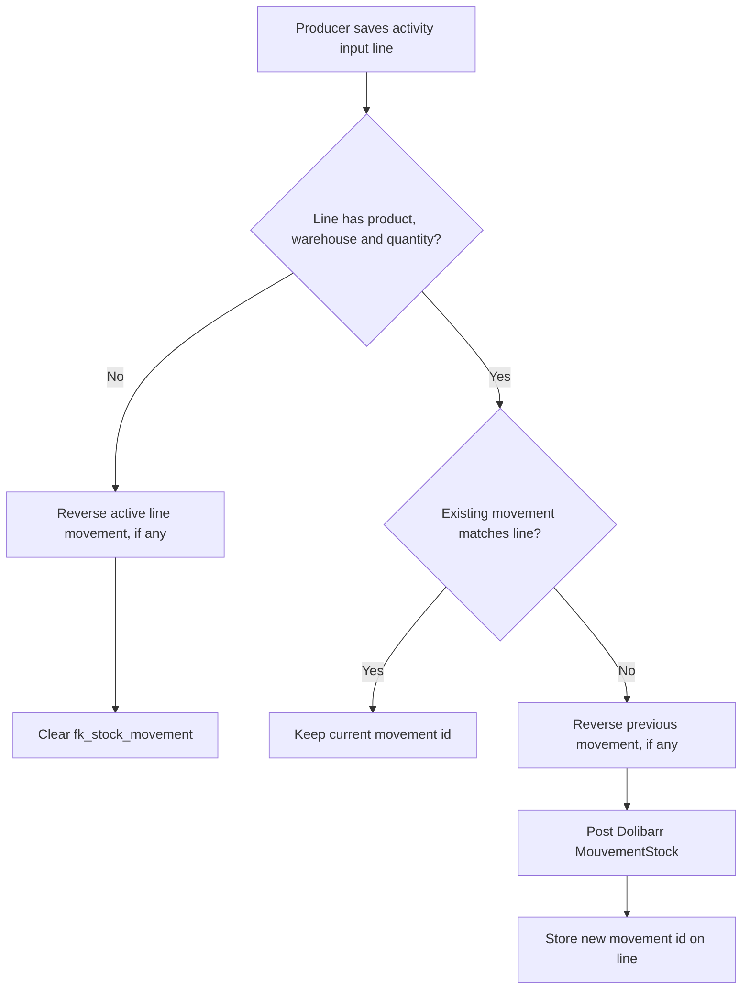

# Safra Activity Stock Workflow

Last updated: 2026-06-03

## Decision
`doc/dolibarr-api.json` exposes standard Dolibarr stock endpoints such as `/stockmovements`, `/stockmovements/{id}`, `/products/{id}/stock` and `/warehouses`. For the Safra activity module, stock integration is done inside Dolibarr with `MouvementStock`, not through REST.

Reason: activity pages and the Safra REST API already execute in the Dolibarr session/user context. Calling `MouvementStock` directly uses the logged-in user, participates in the local database transaction, and avoids storing API credentials. The Dolibarr API remains useful for external integrators, but the module itself should not call Dolibarr REST to modify its own database.

## Rule
Each `safra_activity_line` is the source of truth for one active stock movement:

- `fk_stock_movement` stores the current `llx_stock_mouvement.rowid`.
- `stock_movement_qty` stores the current positive quantity used by the line.
- `origintype` is always `safra_activity`.
- `fk_origin` is always the parent `safra_activity.rowid`.

When product, warehouse, movement type, dose or quantity changes, the previous movement is reversed and a new movement is posted. Historical movements are not physically deleted because deleting a Dolibarr stock movement row does not reliably recalculate stock across versions; reversal keeps the audit trail and leaves stock correct.

## Activity Card Flow
The activity card follows the standard Dolibarr tab pattern:

- `Geral`: stores the activity header, project, field plot, dates, crop, cultivar and area.
- `Insumos`: shows a read-only list. Add/edit opens a modal for product, warehouse, movement type, executed area, dose and executed quantity. Saving the modal is the stock posting surface.
- `Calculo de calda`: reads the saved input lines, calculates spray volume, required tanks, area per tank and input quantity per tank, and persists the calculation on the activity header when the producer clicks update.
- `Equipe`, `Veiculos` and `Implementos`: show read-only lists and use add/edit modals, so optional resources do not increase the first-screen workload.

Selecting a project fills the activity field plot and area from project extrafields when available. The business rule is that one project represents one season for one field plot.

## Flow

## Activity Status
Stock is posted when the input line is saved, not only when the activity is completed. Completing the activity updates operational status and makes sure all current input lines are synchronized. Canceling an activity reverses active line movements and keeps the historical stock trail.

## Project Tasks
Safra activity no longer creates, updates, closes or deletes Dolibarr project tasks. If a task id is explicitly provided, Safra may write the optional `fk_activity` task extrafield only for time tracking/reference.
